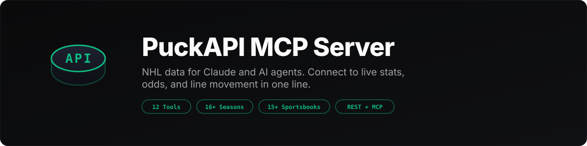

<div align="center">



<br>
<br>

**NHL data for Claude and AI agents.** Connect to live stats, odds,<br>and line movement from 15+ sportsbooks in one line.

<br>

[](LICENSE)
[](#available-tools)
[](#data-coverage)
[](https://github.com/PuckAPI/claude-sports-analytics)

[Quick Start](#quick-start) · [Tools](#available-tools) · [Data](#data-coverage) · [Pricing](#pricing) · [REST API](#rest-api)

</div>

<br>

```
You:    "What were last night's NHL scores?"
Claude: [calls get_games → returns scores, periods, shots, goals]

You:    "Show me the line movement on the Sabres game"
Claude: [calls get_line_movement → opening line, current line, timestamps, book-by-book]

You:    "Compare McDavid and MacKinnon this season"
Claude: [calls get_player_stats x2 → side-by-side goals, assists, points, TOI, shooting %]
```

## Quick Start

**Claude Desktop** -- add to `claude_desktop_config.json`:

```json
{
  "mcpServers": {
    "puckapi": {
      "url": "https://mcp.puckapi.com/mcp?key=YOUR_API_KEY"
    }
  }
}
```

**Claude Code** -- one command:

```bash
claude mcp add puckapi --transport streamable-http "https://mcp.puckapi.com/mcp?key=YOUR_API_KEY"
```

**Other MCP clients** -- any client supporting Streamable HTTP:

| Setting | Value |
|---------|-------|
| URL | `https://mcp.puckapi.com/mcp?key=YOUR_API_KEY` |
| Transport | Streamable HTTP |

<sub>Also accepts `Authorization: Bearer` or `x-api-key` headers.</sub>

**Get your free key** at [puckapi.com](https://puckapi.com) -- 500 credits, no credit card.

---

## Available Tools

<details open>
<summary><strong>Games</strong> -- 4 tools</summary>

<br>

| Tool | Description |
|------|-------------|
| `get_games` | Game results with scores, periods, shots, and goals |
| `get_schedule` | Upcoming and past game schedules |
| `get_game_detail` | Full box score for a specific game |
| `get_head_to_head` | Historical matchup data between two teams |

</details>

<details>
<summary><strong>Teams</strong> -- 3 tools</summary>

<br>

| Tool | Description |
|------|-------------|
| `get_standings` | Current or historical standings by season |
| `get_team_stats` | Team-level stats (goals, shots, PP%, PK%, etc.) |
| `list_teams` | All NHL teams with abbreviations and metadata |

</details>

<details>
<summary><strong>Players</strong> -- 3 tools</summary>

<br>

| Tool | Description |
|------|-------------|
| `search_players` | Find players by name |
| `get_player_stats` | Skater stats (goals, assists, points, TOI, etc.) |
| `get_goalie_stats` | Goalie stats (SV%, GAA, wins, shutouts, etc.) |

</details>

<details>
<summary><strong>Odds</strong> -- 2 tools</summary>

<br>

| Tool | Description |
|------|-------------|
| `get_odds` | Pre-game odds from 15+ sportsbooks (ML, spread, total) |
| `get_line_movement` | Track how lines move from open to close |

</details>

---

## Data Coverage

| Category | Details |
|----------|---------|
| **Seasons** | 2008-09 through current (16+) |
| **Games** | 22,000+ with full box scores |
| **Odds** | Pre-game ML, spread, totals from 15+ books |
| **Line movement** | Opening to closing line tracking |
| **Players** | 3,000+ skaters and goalies |
| **Updates** | Scores and odds refresh throughout the day |

---

## Pricing

| Plan | Credits/mo | Price |
|------|-----------|-------|
| **Free** | 500 | $0 |
| **Starter** | 5,000 | $19/mo |
| **Pro** | 15,000 | $49/mo |
| **Scale** | 50,000 | $149/mo |

Each tool call costs 1 credit. Top up anytime with wallet deposits.

---

## REST API

PuckAPI also offers a standard REST API:

```bash
curl -H "x-api-key: YOUR_API_KEY" \
  https://mcp.puckapi.com/v1/get_standings
```

Full documentation at [puckapi.com/docs](https://puckapi.com/docs).

---

## Related

| | |
|---|---|
| **[PuckAPI Skills](https://github.com/PuckAPI/claude-sports-analytics)** | 28 free Claude Code skills for hockey analytics, betting models, and research |
| **[puckapi.com](https://puckapi.com)** | Sign up, dashboard, API docs |

---

<div align="center">

**[puckapi.com](https://puckapi.com)** · **[API Docs](https://puckapi.com/docs)** · **[Skills](https://github.com/PuckAPI/claude-sports-analytics)**

<sub>MIT License</sub>

</div>
